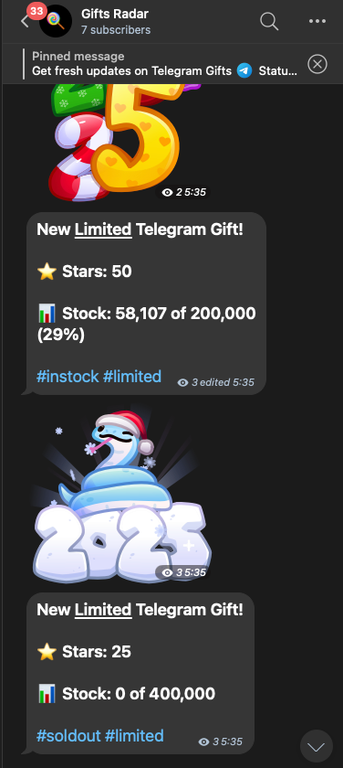

# Telegram Gifts Radar



A Telegram bot that monitors and notifies about new Telegram gifts in real-time.

## Features

- Monitors Telegram gifts every 30 seconds
- Posts notifications about new gifts
- Updates existing gift notifications
- Tracks gift availability and stock status
- Works as a userbot for reliable gift detection

## Tech Stack

- TypeScript
- Bun runtime
- Prisma ORM
- GramJS (Telegram client)
- Docker
- PostgreSQL

## Prerequisites

- A Telegram API key ([obtain here](https://my.telegram.org/apps))
- PostgreSQL database

## Configuration

1. Copy the `.env.example` file:

    ```sh
    cp .env.example .env
    ```

2. Fill in the environment variables in the `.env` file:

    ```sh
    TELEGRAM_SESSION_FILENAME=account
    TELEGRAM_API_ID=          # Your Telegram API ID
    TELEGRAM_API_HASH=        # Your Telegram API hash
    TELEGRAM_DEVICE_MODEL=    # e.g. "MacBook Air M1"
    TELEGRAM_SYSTEM_VERSION=  # e.g. "macOS 14.4.1" 
    TELEGRAM_APP_VERSION=     # e.g. "4.16.8 arm64"

    DATABASE_URL=             # PostgreSQL connection string
    CHAT_IDS=                 # Comma-separated list of Telegram chat IDs to notify in
    ```

## Deployment

### Using Docker (Recommended)

> Make sure you have [Docker](https://bun.sh/) installed

1. Build the Docker image:

    ```sh
    sh scripts/build.sh
    ```

2. Run with integrated terminal to log into account, then Ctrl+C to stop

    ```sh
    sh scripts/run_integrated.sh
    ```

3. Run container in background (docker-compose)

    ```sh
    sh scripts/run.sh
    ```

### Manual Instalation

> Make sure you have [Bun](https://bun.sh) installed

1. Install dependencies

    ```sh
    bun install
    bunx prisma generate
    ```

2. Run database migrations

    ```sh
    bun run migrate
    ```

3. Start the application

    ```sh
    bun run start
    ```

## License

[MIT License](LICENSE)

## Author

[Contact](t.me/maxktz) • [Telegram Channel](t.me/xcrypto_dev)
